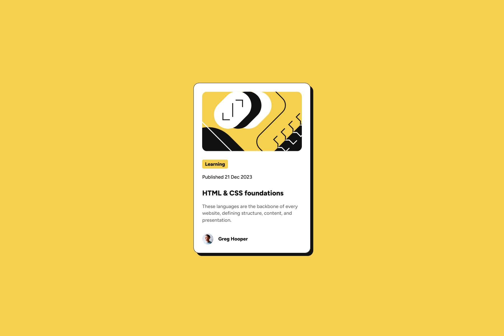

# Frontend Mentor - Blog Preview Card Solution

This is a solution to the [Blog preview card challenge on Frontend Mentor](https://www.frontendmentor.io/challenges/blog-preview-card-ckPaj01IcS).

## Table of contents

- [Overview](#overview)
  - [Screenshot](#screenshot)
  - [Links](#links)
- [My process](#my-process)
  - [Built with](#built-with)
  - [Useful resources](#useful-resources)
- [Author](#author)

## Overview

### Screenshot

Desktop

### Links

- [Solution URL](https://github.com/ankitashokgond/frontendmentor-lp/tree/main/paths/first/blog-preview-card)
- [Live Site URL](https://ankitashokgond.github.io/frontendmentor-lp/paths/first/blog-preview-card)

## My process

### Built with

- Semantic HTML5 markup
- CSS custom properties
- Flexbox
- Mobile-first workflow

### Useful resources

- [Google Fonts](https://fonts.google.com/specimen/Figtree)

## Author

- GitHub - [@ankitashokgond](https://github.com/ankitashokgond)
- Frontend Mentor - [@ankitashokgond](https://www.frontendmentor.io/profile/ankitashokgond)