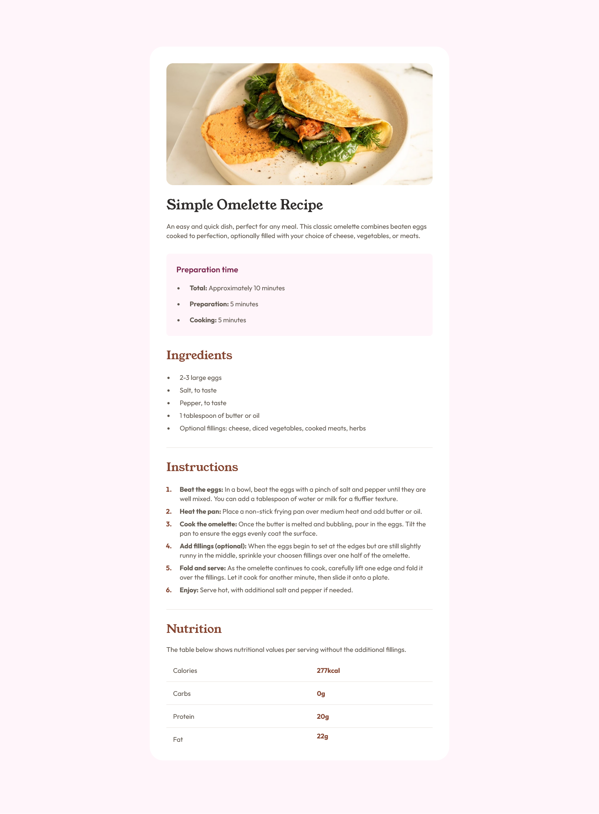

# Frontend Mentor - Recipe Page Solution

This is a solution to the [Recipe Page challenge on Fronend Mentor](https://www.frontendmentor.io/challenges/recipe-page-KiTsR8QQKm).

## Table of contents

- [Overview](#overview)
  - [Screenshots](#screenshots)
  - [Links](#links)
- [My process](#my-process)
  - [Built with](#built-with)
  - [Useful resources](#useful-resources)
- [Author](#author)

## Overview

### Screenshots

Desktop

### Links

- [Solution URL](https://github.com/ankitashokgond/frontendmentor-lp/tree/main/paths/first/recipe-page)
- [Live Site  URL](https://ankitashokgond.github.io/frontendmentor-lp/paths/first/recipe-page)

## My process

### Built with

- Semantic HTML5 markup
- CSS custom properties
- Flexbox
- Mobile-first workflow

### Useful resources

- Google Fonts
  - Family: [Young Serif](https://fonts.google.com/specimen/Young+Serif)
  - Weight: 400
  
  - Family: [Outfit](https://fonts.google.com/specimen/Outfit)
  - Weights: 400, 600, 700

## Author

- Github - [@ankitashokgond](https://github.com/ankitashokgond)
- Frontend Mentor - [@ankitashokgond](https://www.frontendmentor.io/profile/ankitashokgond)