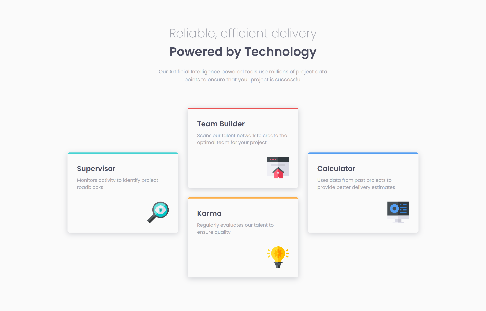

# Frontend Mentor - Four Card Feature Section Solution

This is a solution to the [Four card feature section challenge on Frontend Mentor](https://www.frontendmentor.io/challenges/four-card-feature-section-weK1eFYK).

## Table of contents

- [Overview](#overview)
  - [Screenshot](#screenshot)
  - [Links](#links)
- [My process](#my-process)
  - [Built with](#built-with)
  - [Useful resources](#useful-resources)
- [Author](#author)

## Overview

### Screenshots

Desktop

### Links

- [Live Site URL](https://ankitashokgond.github.io/frontendmentor-lp/paths/second/four-card-feature-section)

## My process

### Built with

- Semantic HTML5 markup
- CSS custom properties
- Flexbox
- Mobile-first workflow

### Useful resources

- Google Fonts
  - Family: [Poppins](https://fonts.google.com/specimen/Poppins)
  - Weights: 200, 400, 600

## Author

- Github - [@ankitashokgond](https://github.com/ankitashokgond)
- Frontend Mentor - [@ankitashokgond](https://www.frontendmentor.io/profile/ankitashokgond)