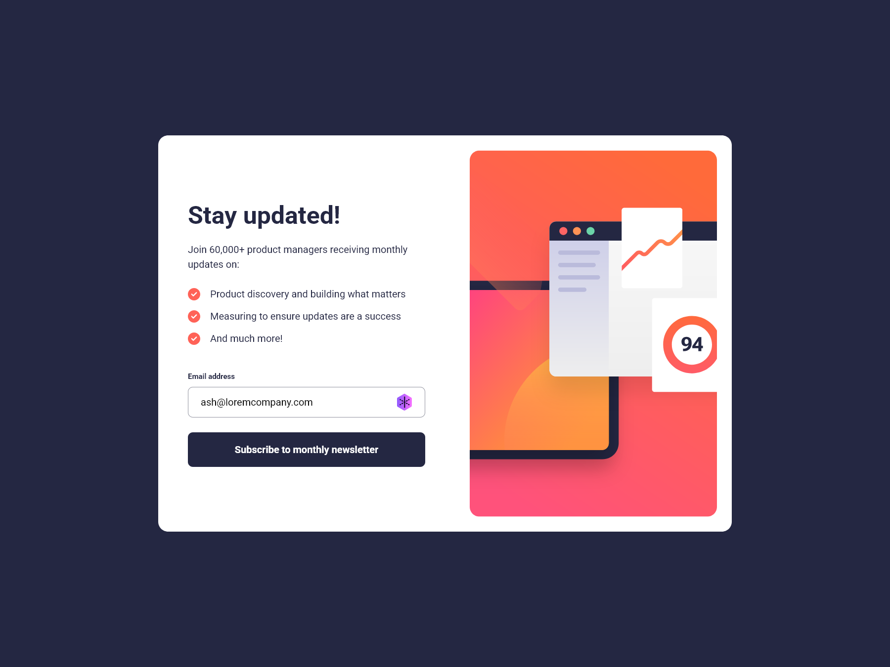

# Frontend Mentor - Nesletter Sign-up Form with Success Message Solution

This is a solution to the [Newsletter sign-up form with success message challenge on Frontend Mentor](https://www.frontendmentor.io/challenges/newsletter-signup-form-with-success-message-3FC1AZbNrv).

## Table of contents

- [Overview](#overview)
  - [Screenshot](#screenshot)
  - [Links](#links)
- [My process](#my-process)
  - [Built with](#built-with)
  - [Useful resources](#useful-resources)
- [Author](#author)

## Overview

### Screenshots

Desktop

### Links

- [Live Site URL](https://ankitashokgond.github.io/frontendmentor-lp/paths/third/newsletter-sign-up-with-success-message/)

## My process

### Built with

- Semantic HTML5 markup
- CSS custom properties
- Flexbox
- Mobile-first workflow

### Useful resources

- Google Fonts
  - Family: [Roboto](https://fonts.google.com/specimen/Roboto)
  - Weights: 400, 700

## Author

- Github - [@ankitashokgond](https://github.com/ankitashokgond)
- Frontend Mentor - [@ankitashokgond](https://www.frontendmentor.io/profile/ankitashokgond)